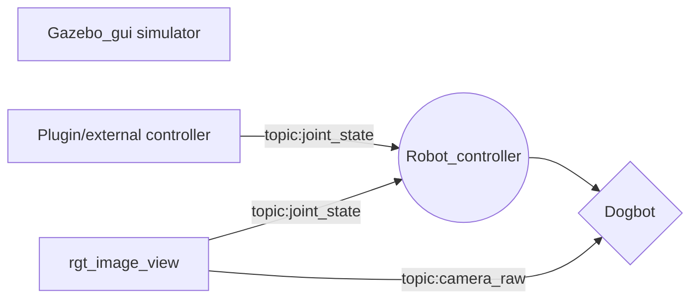

# dogbot in ROS

A quick project of building a **dog bot** and physical simulation environment in **ROS**.

## Quick look

[GIF] quick look

### Dogbot mechanical structure 

    roslaunch dogbot dogbot_rvis.launch

*rivs displays robot TF*
The robot description file contains
 - material
 - geometry
 - collision box
 - inertial and msss
 - joints/transfer
 - actuators/fake Hardware Interface
 - camera
 ### physical simulation

    roslaunch dogbot dogbot_gazebo.launch word:=willowgarage_world.launcg
  
  launch gazebo for  simulation 

  
### camera raw image simulation
     rosrun rqt_image_view rqt_image_view

### joints_state controller
     rosrun rqt_gui rqt_gui

### Architect

## Usage

> To install **ROS**, please check [ROS wiki](https://wiki.ros.org/ROS/Installation).

 1. clone the poject
 2. initialize catkin workspace
 3.  `catkin_make` to cmake in the project directory

>if catkin_make can't locate you gazebo_ros config, try add prefix "PKG_CONGIG_PATH=$(rospack find gazebo_ros)/cmake cmake .." at the dogbot directory.
