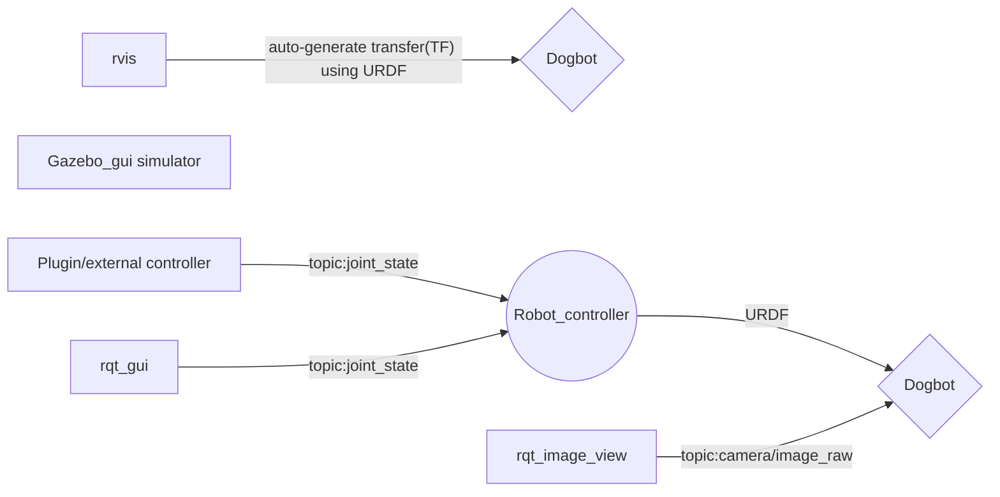

# Quick look


A quick project of building a **dog bot** and **physical simulation environment** in **ROS**.
## Dogbot mechanics


The robot description file contains
 - **material**
 - **geometry**
 - **collision box**
 - **inertia and mass**
 - **joints/transfer**
 - **actuators/fake Hardware Interface**
 - **camera**
 ```
roslaunch dogbot dogbot_rvis.launch
 ```

*rivs displays robot TF*<br/>

 ## physical simulation

    roslaunch dogbot dogbot_gazebo.launch word:=willowgarage_world.launch
  
launch gazebo for simulation 

  
## Camera raw image simulation
     rosrun rqt_image_view rqt_image_view
simulate camera data installed under dog head


## Joints_state controller
to open a node for joint control
```
roslaunch dogbot dogbot_controller.launch
```

to publish commands for the joint_state topic
```
rosrun rqt_gui rqt_gui
```
create a node to control joints of the dog 


## Architect

## Usage


> To install **ROS**, please check [ROS wiki](https://wiki.ros.org/ROS/Installation).


 1. clone the poject
 2. initialize catkin workspace
 3.  `catkin_make` to cmake in the project directory
 4. >if catkin_make can't locate you gazebo_ros config, try add prefix "PKG_CONFIG_PATH=$(rospack find gazebo_ros)/cmake cmake .." at the dogbot directory.
 5. run above commands
# dogbot_ros
